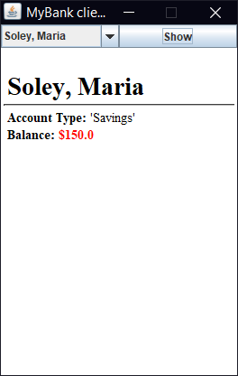

# UI Lab 3

## На "чотири"
1. Перепишіть код  так, щоб інформація про клієнтів банку та їх рахунки читалась з файлу **test.dat** (робота номер 8, [файл даних](https://github.com/ppc-ntu-khpi/GUI-Lab1-Starter/blob/master/data/test.dat) також є в цьому ж репозиторію)
2. При виборі клієнта має виводитись інформація про всі його рахунки!
3. Запустіть проект, впевніться, що все працює як очікувалось. Продемонстрируйте результат викладачеві.